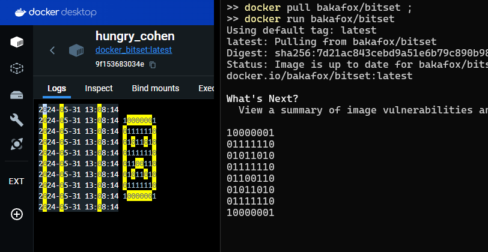

Программа на C++ и Qt, сделанная в Qt Creator на основе https://www.qcustomplot.com/index.php/demos/sincscatterdemo

### Хорошая, годная инструкция по QT Creator

https://metanit.com/cpp/qt/1.2.php

### Как установить QT в России?

https://vc.ru/dev/1125830-kak-ustanovit-qt-qt5-qt6-v-rossii-cherez-onlain-installyator-pri-blokirovke-ip-adresov

(ахтунг — качаться будет очень долго)

### Как установить QCustomPlot на Windows?

https://www.qcustomplot.com/index.php/support/forum/1293